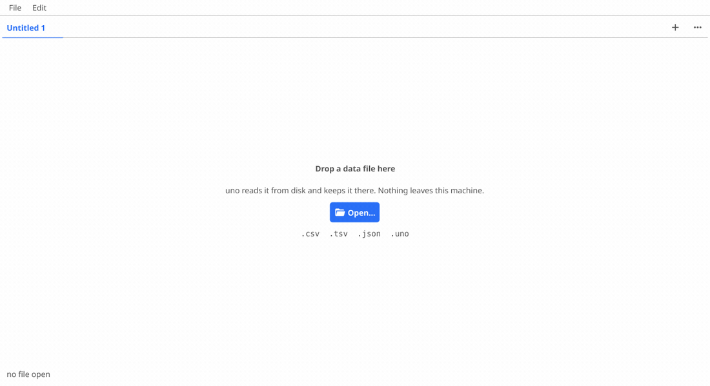

# uno

Easy spreadsheet handler



Open a data file, fix what does not parse, and save it as a `.uno` that keeps
the original bytes alongside the log of every edit. Nothing leaves the machine.

Fix the same thing three times and uno works out what you meant. It reads the
edits you have already made, induces the transformation that explains all of
them, and offers it for the rows you have not looked at — naming what it would
do, counting the cells, and showing you the diff first. Accepting it writes one
line to the log rather than one per cell, so a column of 3,149 corrections is
still a single press of undo.

## Opening a .uno from the desktop

```
packaging/linux/associate.sh install
```

builds uno into `~/.local/bin` and registers `.uno` with the desktop, so
double-clicking one opens it. Windows has the same thing as
`packaging/windows/associate.ps1`. See [packaging/README.md](packaging/README.md)
for what each platform declares, and why macOS is not among them.
